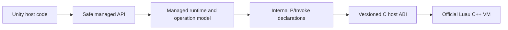

# Luau for Unity

Luau for Unity embeds the official [Luau](https://luau.org/) VM — the language
Roblox built to run untrusted player scripts at scale — with a safe managed API,
attribute-generated host bindings, and maintained native plugins for Windows and
Android.

Built by [Quantum Lion Labs](https://github.com/Quantum-Lion-Labs) to power
modding in [NervBox](https://nervbox.com/).

[](https://github.com/Quantum-Lion-Labs/Luau-Unity/releases)
[](LICENSE)

> [!CAUTION]
> Luau for Unity is currently a preview. Breaking API cleanup may still occur.

## Why

- **Let players script your game.** Untrusted mods are the design center, not a
  feature flag. Every default assumes the script is hostile.
- **Luau is proven for exactly this.** Roblox built it to compile and run user scripts at massive scale, 
  and treats compiler crashes on hostile source as security vulnerabilities.
- **Scripts reach only what you hand them.** No `GameObject.Find`, no filesystem,
  no ambient authority. Types you own get generated bindings from two attributes;
  types you don't get a small descriptor you write and name at each handle.
- **Ships where your game ships.** No reflection, so IL2CPP and AOT work.
  Maintained plugins for Windows and Android.
- **Fast iteration comes free.** Gameplay in text files your designers can own,
  with no domain reload.

## Maintained platforms

| Platform | Architecture | Native plugin | Verification |
| --- | --- | --- | --- |
| Windows | x64 | `luau_host.dll` | Editor, EditMode, Win64 IL2CPP smoke |
| Android | ARM64 | `libluau_host.so` | ARM64 IL2CPP device smoke |
| Android | x64 | `libluau_host.so` | x64 emulator smoke |

The package requires Unity 6000.3.0f1 or newer in the 6000.3 stream. The
canonical integration project remains pinned to 6000.3.19f1, while local Linux
validation may use any installed 6000.3 patch. Only the three targets above are
shipping targets. Linux x64 is supported as a development and test host only;
its native library is staged into disposable projects and never enters the UPM
package.

Before its first compile or state creation, the managed runtime verifies the
native host's self-description, ABI layout, required features, pinned Luau
revision, and build fingerprint, so a mismatched plugin fails immediately and
loudly rather than at a random call site.

## Installation

In Unity Package Manager, choose **Add package from git URL** and enter:

```text
https://github.com/Quantum-Lion-Labs/Luau-Unity.git?path=Luau.Unity#v0.3.1
```

Or add it to `Packages/manifest.json`:

```json
{
  "dependencies": {
    "com.qll.luau.unity": "https://github.com/Quantum-Lion-Labs/Luau-Unity.git?path=Luau.Unity#v0.3.1"
  }
}
```

Then import the **Getting Started** sample from the package's Samples tab.

## Quick start

Expose a C# API to Luau:

```csharp
using Luau;

[LuauLibrary("game")]
public sealed partial class GameLibrary
{
    [LuauMember("log")]
    public static void Log(string message) => Debug.Log($"[luau] {message}");
}
```

Write a script — Unity imports any `.luau` file under `Assets` as a `LuauAsset`,
compiling it once so syntax errors appear in the Console immediately:

```luau
game.log("hello from Luau")
return 21 * 2
```

Run it:

```csharp
using Luau;
using Luau.Unity;
using UnityEngine;

public sealed class HelloLuau : MonoBehaviour
{
    [SerializeField] LuauAsset script;

    async void Start()
    {
        using var root = LuauUnity.CreateState(new LuauUnityOptions
        {
            ConfigureHostApis = state => state.OpenLibrary(new GameLibrary()),
        });
        using var results = await root.ExecuteAsync(script, destroyCancellationToken);

        Debug.Log(results[0].Read<int>()); // 42
    }
}
```

`ExecuteAsync` compiles on a background queue and resumes on the Unity main
thread, so a large script won't hitch. One VM and all its threads are
serialized; separate VMs run concurrently.

Trusted project scripts can instead opt into package-managed precompilation:
choose **First-party precompile with generated manifest** in Project Settings,
set a provenance ID, enable **Precompile** on selected assets, and create the
state with `LuauUnityOptions.UseFirstPartyBytecode = true`. The player build
embeds a manifest for that exact project snapshot; source-only and mod assets
remain on the compiler path. See
[precompiled bytecode](Luau.Unity/Documentation~/artifacts.md).

For the setup you actually want in a real project — one VM shared across the
game, one sandboxed thread per scripted object, and script functions your game
calls each frame — see [Getting started](Luau.Unity/Documentation~/getting-started.md).

## Samples

Two samples ship with the package:

- **Getting Started** teaches one mechanism at a time: state and result
  ownership, generated host libraries, generated capabilities for types you own,
  hand-written descriptors for the ones you don't, and explicit sandbox
  injection.
- **Full Luau Scripting Demo** pairs a reusable `Core/` with a one-scene Flappy
  Bird game written entirely in Luau. The core handles lifecycle scheduling,
  prefab spawning against a per-behaviour cap, explicit references, input and
  quaternion libraries, and the Unity capability policy the game runs on. Delete
  `Demo Game/` to use the core as a starter kit.

Those Unity policies are sample code you edit, not a package default switching
on. The package itself defines no Luau-visible surface for any Unity type.

## Documentation

| Guide | Covers |
| --- | --- |
| [Getting started](Luau.Unity/Documentation~/getting-started.md) | Install, hello world, and the six lessons behind a real setup |
| [Concepts and vocabulary](Luau.Unity/Documentation~/concepts.md) | Every term used across these docs, in Unity terms |
| [Exposing C# to Luau](Luau.Unity/Documentation~/capability-bindings.md) | Generated capabilities, manual descriptors, callbacks, ownership |
| [Running scripts you didn't write](Luau.Unity/Documentation~/execution-and-trust.md) | Source vs compiler output vs bytecode; the mod path |
| [Resource limits](Luau.Unity/Documentation~/resource-limits.md) | Memory, time, and size ceilings, and how to change them safely |
| [Modules and `require()`](Luau.Unity/Documentation~/modules.md) | Module maps, bundles, and per-root namespaces |
| [Precompiled bytecode](Luau.Unity/Documentation~/artifacts.md) | Artifacts, validators, and why integrity isn't trust |
| [Compiler security](Luau.Unity/Documentation~/compiler-security.md) | What the sandbox protects against, and what it doesn't |

## Security posture

Untrusted mods drove the design, so the defaults assume the script is hostile:

- **Finite by default.** Memory, execution time, source and bytecode size, result
  count, handle count, and logging rate all have ceilings out of the box.
  Removing them requires a visibly named profile like
  `LuauStateOptions.UnboundedResources`.
- **No ambient authority.** No `GameObject.Find` from Luau, no filesystem, no
  `Resources` or Addressables, and no package-defined `GameObject` or
  `Transform` surface. A script reaches an object because you handed it a
  capability, under a policy you named at that call site.
- **Frozen globals.** Host APIs register before the root is sandboxed; after
  that, nothing can replace them.
- **Source, not bytecode.** `LuauBytecodePolicy.Reject` is both the default and
  the zero enum value. Loading precompiled bytecode requires either the explicit
  generated-manifest option or a custom validator, because bytecode skips the
  compiler entirely.
- **One VM per trust domain.** Everything inside a root shares memory, host APIs,
  and a module cache. Mutually untrusted mods get separate roots.

Two things this does **not** give you, stated plainly: the in-process native
compiler is not a hard security boundary — a native crash takes down the process
and a native hang can't be preempted — and VM memory accounting doesn't cover
allocations your own callbacks make. See
[compiler security](Luau.Unity/Documentation~/compiler-security.md) for the full
accounting and the mitigations worth layering on top.

## How it works

The shipped product is the standalone UPM package under `Luau.Unity`. The .NET
projects in this repository build and test that package; they are not a separate
distribution.



The package owns the authoritative interop declarations. `Luau.Interop` mirrors
only the narrow, repository-owned `luau_host_*` ABI and is not a consumer API;
the native binary exports nothing else.

`Luau.dll` ships as a deterministic prebuilt Release artifact targeting
`netstandard2.1`, and the net9 test harness runs against that same binary.
Compiling the runtime as Unity source was considered and rejected: the compiler
and dependency accommodations it required added more complexity than the copy
step they removed.

## Building and validating

```bash
dotnet restore Luau.slnx

# Fast managed validation; on Linux, build/install linux-x64 first.
# This never mutates package artifacts.
dotnet test Luau.slnx --no-restore

# Static package and deterministic release checks used by CI.
dotnet run --project tools/Luau.Tooling -- package-static
dotnet run --project tools/Luau.Tooling -- package-release

# Complete Linux development gate: native host, all .NET tests, generated
# consumer, Unity compile/EditMode tests, and a Linux x64 IL2CPP player smoke.
dotnet run --project tools/Luau.Tooling -- validate-linux \
  --unity /path/to/6000.3.xf1/Editor/Unity \
  --unity-version 6000.3.xf1
```

Native plugins build separately from the CMake presets under
`native/luau-host`. Managed refresh copies only `Luau.dll`, its `Luau.xml`
IntelliSense file, and `Luau.SourceGenerator.dll`.

Pushing a `v*.*.*` tag starts the release workflow: it reruns managed, native,
sanitizer, fuzz, and deterministic-package validation, requires the tag to equal
`v` plus the version in `Luau.Unity/package.json`, then publishes the archive and
manifest on a GitHub Release. Hosted runners skip only the Unity consumer check,
which has no licensed editor.

The [Linux development guide](docs/linux-development.md) covers workstation
setup and the disposable staging boundary. The
[maintainer guide](docs/maintainer-guide.md) covers authority boundaries,
operation semantics, artifact refresh, and the full validation recipes.

## Attribution

Luau.Unity began as a fork of
[nuskey8/luau-dotnet](https://github.com/nuskey8/luau-dotnet), originally
authored by Yusuke Nakada and released under the MIT License. Both copyright lines live in [`LICENSE`](./LICENSE).

This repository takes that foundation in a Unity-first direction. `Luau.Unity`
is a standalone UPM package with a bounded managed API, source-generated host
bindings, explicit trust and resource policies, and maintained native plugins
for Windows and Android. The .NET solution is a fast build and test harness over
the same managed implementation rather than a separate distribution. Package
consumer, Unity EditMode, and player-smoke validation cover the code that ships
to Unity projects, with untrusted mod source and precompiled game scripts both
treated as first-class use cases for Quantum Lion Labs and NervBox.

The native runtime and compiler are the official
[Luau VM](https://github.com/luau-lang/luau), developed by Roblox and pinned as
an upstream submodule. This repository provides the versioned host ABI and the
managed and Unity integration around it. See
[`Luau.Unity/Third Party Notices.md`](Luau.Unity/Third%20Party%20Notices.md) for
the Luau and other redistributed dependency notices.

## License

MIT
